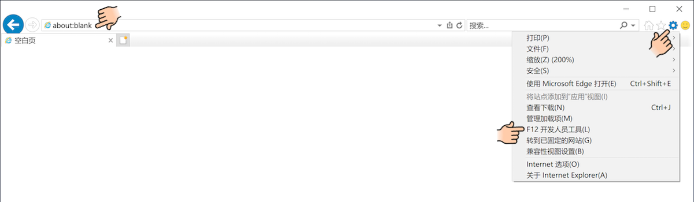
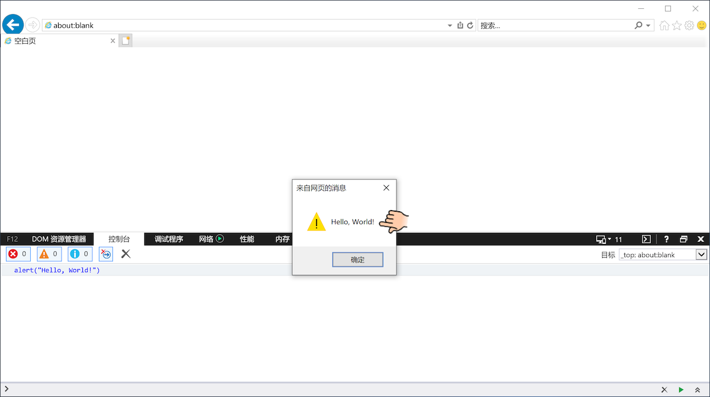
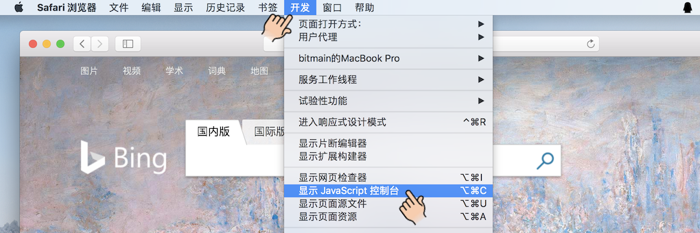
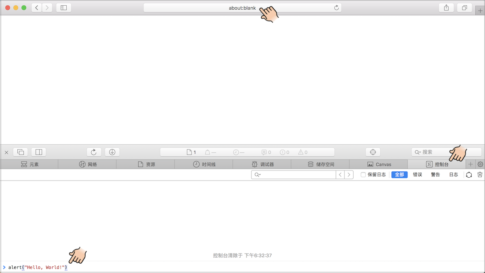
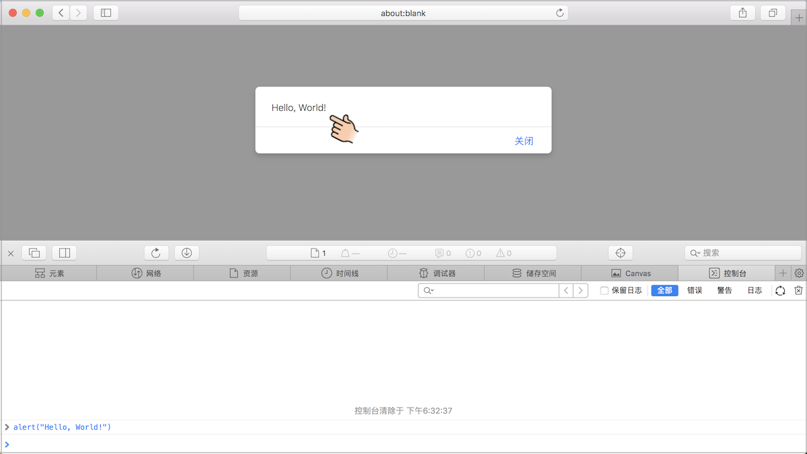

# 第2课 成为小程序员

本课内容

* 认识浏览器开发者工具
  * Edge浏览器
  * IE浏览器
  * Firefox浏览器
  * Chrome浏览器
  * Safari浏览器
* 小技巧

* 趣味小实验
* 词汇表
* 小结

## 2.1 认识浏览器开发者工具

这一节依次介绍如何在Windows下的Edge、IE 11、Firfox、Chrome和macOS下的Safari浏览器中开启**开发者工具**，以及如何在开发者工具里编写并运行JavaScript代码。请小朋友们确认自己使用的是哪种浏览器，然后跳到相应的小节开始学习。让我们从最新的Edge浏览器开始。

### 2.1.1 Edge浏览器

打开Edge浏览器，在**地址栏**里输入`about:blank`然后按回车键，这样就打开了一个空白页面，如下图所示。

​			（图2-6 Edge浏览器空白页面）

在浏览器窗口的右上角，关闭按钮（小叉子）的下面，可以看到三个小点，点它就可以展开“**设置及其他**”菜单。点击菜单下方的“**更多工具**”菜单项，可以展开另一个小菜单。点击小菜单里的“**开发人员工具**”菜单项就可以打开开发人员工具，如下图所示。另外，我们也可以通过直接按键盘上的**F12**键打开开发人员工具。

​			（图2-7 打开Edge浏览器开发人员工具）

此时浏览器窗口分成了两个部分，开发人员工具默认在右边。开发人员工具有好几个选项卡，我们需要选中“**控制台**”选项卡，这样选项卡的下面就会出现一个小的输入框，输入框的最左边是一个`>`符号，提示我们在这里可以输入JavaScript代码。请小朋友们在输入框里输入`alert("Hello, World!")`，然后按回车键。这里一定要输入英文的**圆括号**和**引号**，千万不能出错。如果没有输入错误的话，按下回车键之后就会弹出一个对话框，上面会显示“Hello, World!”，点击文字下方的“确定”按钮可以关闭对话框，如下图所示。恭喜你正式成为了一名JavaScript小程序员！

​			（图2-8 在Edge浏览器里执行JavaScript代码）

### 2.1.2 IE浏览器

打开IE浏览器，在**地址栏**里输入`about:blank`然后按回车键，这样就打开了一个空白页面。在浏览器窗口的右上角，关闭按钮（小叉子）的下面，可以看到一个小齿轮，点它就可以展开“**工具**”菜单。点击菜单下方的“**开发人员工具**”菜单项就可以打开开发人员工具，如下图所示。另外，我们也可以通过直接按键盘上的**F12**键打开开发人员工具。

​		（图2-9 打开IE浏览器开发人员工具）

此时浏览器窗口分成了两个部分，开发人员工具默认在下边。开发人员工具有好几个选项卡，我们需要选中“**控制台**”选项卡，这样选项卡的底部就会出现一个输入框，输入框的最左边是一个`>`符号，提示我们在这里可以输入JavaScript代码。请小朋友们在输入框里输入`alert("Hello, World!")`，然后按回车键，如下图所示。

​		（图2-10 在IE浏览器里输入JavaScript代码）

注意一定要输入英文的**圆括号**和**引号**，千万不能出错。如果没有输入错误的话，按下回车键之后就会弹出一个对话框，上面会显示“Hello, World!”，点击文字下方的“确定”按钮可以关闭对话框，如下图所示。恭喜你正式成为了一名JavaScript小程序员！

​		（图2-11 在IE浏览器里执行JavaScript代码）

### 2.1.3 Firefox浏览器

打开Firefox浏览器，在**地址栏**里输入`about:blank`然后按回车键，这样就打开了一个空白页面。在浏览器窗口的右上角，关闭按钮（小叉子）的下面，可以看到三条短横杠，点它就可以展开菜单。菜单的下面有一个“**Web开发者**”菜单项，如下图所示。

​			（图2-12 打开Firefox菜单）

点击“Web开发者”菜单项会进入另外一个菜单，靠上面有一个选项是“**Web控制台**”菜单项，如下图所示：

​			（图2-13 打开FirefoxWeb开发者菜单）

点击“Web控制台”菜单项就可以打开开发者工具，如下图所示。另外，我们也可以通过同时按下键盘上的**Ctrl+Shift+K**键打开开发者工具。此时浏览器窗口分成了两个部分，开发者工具默认在下边。开发者工具有好几个选项卡，我们需要选中“**控制台**”选项卡，这样选项卡的下方会出现一个输入框，输入框的最左边是一个`>>`符号，提示我们在这里可以输入JavaScript代码。

​			（图2-14 在Firefox浏览器里执行JavaScript代码）

请小朋友们在输入框里输入`alert("Hello, World!")`，然后按下回车键。注意一定要输入英文的**圆括号**和**引号**，千万不能出错。如果没有输入错误的话，按下回车键之后就会弹出一个对话框，上面会显示“Hello, World!”，点击文字下方的“确定”按钮可以关闭对话框，如上图所示。恭喜你正式成为了一名JavaScript小程序员！

### 2.1.4 Chrome浏览器

打开Chrome浏览器，在**地址栏**里输入`about:blank`然后按回车键，这样就打开了一个空白页面。在浏览器窗口的右上角，关闭按钮（小叉子）的下面，可以看到三个小点，点它就可以展开菜单。菜单的下方有一个“**更多工具**”菜单项，点这个菜单项会展开另外一个小菜单，小菜单的下方有一个“**开发者工具**”菜单项，点击它就可以打开开发者工具，如下图所示。另外，我们也可以通过同时按下键盘上的**Ctrl+Shift+I**键打开开发者工具。

​			（图2-15 打开Chrome浏览器开发者工具）

此时浏览器窗口分成了两个部分，开发者工具默认在右边。开发者工具有好几个选项卡，我们需要选中“**控制台**”选项卡，这样选项卡的下方会出现一个输入框，输入框的最左边是一个`>`符号，提示我们在这里可以输入JavaScript代码。请小朋友们在输入框里输入`alert("Hello, World!")`，然后按回车键，如下图所示。

​			（图2-16 在Chrome浏览器里输入JavaScript代码）

注意一定要输入英文的**圆括号**和**引号**，千万不能出错。如果没有输入错误的话，按下回车键之后就会弹出一个对话框，上面会显示“Hello, World!”，点击文字下方的“确定”按钮可以关闭对话框，如下图所示。恭喜你正式成为了一名JavaScript小程序员！

​			（图2-17 在Chrome浏览器里执行JavaScript代码）

### 2.1.5 Safari浏览器

打开Safari浏览器，在**地址栏**里输入`about:blank`然后按回车键，这样就打开了一个空白页面。和其他浏览器不同，Safari浏览器需要设置一下才能打开开发者工具。从菜单栏中打开“**偏好设置**”对话框，然后选中“**高级**”选项卡，最后在“**在菜单栏中显示“开发”菜单**”复选框中打勾并关闭对话框就可以了，具体操作如下图所示。

​			（图2-18 在Safari浏览器菜单栏中显示“开发”菜单）

设置完毕后，菜单栏里会出现“**开发**”菜单项。展开“开发”菜单，可以看到“**显示JavaScript控制台**”菜单项，点击它就可以打开开发者工具，如下图所示。另外，也可以通过同时按下键盘上的**⌥+⌘+I**键打开开发者工具。

​			（图2-19 在Safari浏览器显示JavaScript控制台）

此时浏览器窗口分成了两个部分，开发者工具默认会出现在下边。开发者工具有好几个选项卡，我们需要选中“**控制台**”选项卡，这样开发者工具的最下面会出现一个输入框，输入框的最左边是一个`>`符号，提示我们在这里可以输入JavaScript代码。请小朋友们在输入框里输入`alert("Hello, World!")`，然后按回车键，如下图所示。

​			（图2-20 在Safari浏览器里输入JavaScript代码）

注意一定要输入英文的**圆括号**和**引号**，千万不能出错。如果没有输入错误的话，按下回车键之后就会弹出一个对话框，上面会显示“Hello, World!”，点击文字下方的“确定”按钮可以关闭对话框，如下图所示。恭喜你正式成为了一名JavaScript小程序员！

​			（图2-21 在Safari浏览器里执行JavaScript代码）

## 2.2 小技巧

由于我们以后要经常使用开发者工具，特别是使用控制台编写并执行JavaScript程序，所以这一小节介绍几个操作方面的小技巧。有了这些技巧，使用起开发者工具来就会更加得心应手。

1. 如果想关闭开发者工具，点工具左上角或者右上角的小叉子即可。
2. 选中JavaScript输入框，按键盘上的上下箭头键（⇧⇩）可以快速输入之前执行过的代码。
3. JavaScript输入框里默认只能输入一行代码，按回车就会执行代码。如果想输入多行代码，可以先按住Shift再按回车键。
4. 执行JavaScript代码后，控制台里可能会出现很多信息。这些信息在后面会变得非常有用，如果想清理这些信息，点击控制台选项卡下方的小垃圾桶、小叉子或者带斜线的圆圈（⦸）即可。
5. 每个浏览器都有默认的开发者工具停靠方式，如果想改变停靠方式，或者把开发者工具变成单独的窗口，在Edge和IE浏览器里直接点击开发者工具小叉子左边的小窗口即可。在Firefox和Chrome浏览器里，先点击小叉子左边的三个小点，然后在展开的菜单里选择不同的停靠方式。在Safari浏览器里，先点击开发者工具右上角的小齿轮，然后在展开的菜单里选择不同的停靠方式。

以Chrome浏览器为例，这些操作开发者工具的小图标如下图所示。本书后面的章节主要使用Chrome浏览器演示JavaScript代码，不过这些代码在其他浏览器里的执行效果也应该一样。

​			（图2-22 操作Chrome浏览器开发者工具）

## 2.3 趣味小实验

这一节我们一起来做一个有趣的小实验。请小朋友们打开浏览器和开发者工具，在控制台里输入这行代码后按回车键：`document.body.style.backgroundColor = "yellow"`。怎么样？有没有观察到什么变化？再把`yellow`换成其他颜色的单词，比如`red`，看看会出现什么效果。

​			（图2-23 用JavaScript改变浏览器背景颜色）

## 2.4 词汇表

* **About** 关于
* **Alert** 警告
* **Blank** 空白
* **Menu** 菜单
* **Script** 剧本/脚本

## 2.5 小结

TODO

