# 第4课 真假和逻辑运算

本章内容

* 布尔值
* 布尔运算
  * 与、或、非
* 比较运算
  * 等于、不等于、大于、大于等于、小于、小于等于
* 趣味小实验
* 词汇表
* 小结
* 练习

## 4.1 布尔值

**布尔值**也叫**逻辑值**。在第三章我们讨论了数字和加减乘除等算术运算，我们都知道，即使是最简单的整数也有无穷多个，永远都没办法数完。相比之下，布尔值就少的可怜，只有区区两个：**真**和**假**。可别小看这两个值哦，因为我们只需要这两个值就可以描述整个世界。而实际上，不管多么强大的电子计算机，说到底也只认识两个数：0和1。0代表假，1代表真。

1847年，一位叫做乔治·布尔（[George Boole](https://en.wikipedia.org/wiki/George_Boole)）的英国数学家（同时也是哲学家和逻辑学家）出版了一本数学名著：《逻辑的数学分析》。在这本书里，布尔介绍了一种非常有趣的代数运算，这种运算只对0和1进行计算，结果也只是0和1（我们马上就会学习这种计算）。这种简单的运算对数学、逻辑学和后来的计算机科学产生了深远影响，并最终演变成了代数的一个分支。为了纪念这位杰出的数学家，后人把这门代数的分支学科命名为**布尔代数**，把布尔在书里介绍的运算命名为**布尔运算**，把1（真）和0（假）命名为**布尔值**。下图为布尔45岁时的画像。

​				（乔治·布尔，1815～1864，图片来源于Wikipedia）

在JavaScript语言里，真用`true`表示，假用`false`表示。请小朋友们注意，`true`和`false`的所有字母全部都要小写哦，稍有差错浏览器可就不认识了。就像数字一样，如果我们在浏览器控制台里输入布尔值，控制台就会原样回显给我们，如下图所示。

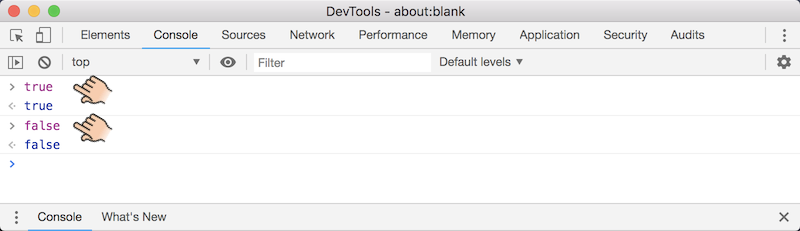

​			（图4-1 在控制台中输入布尔值）

## 4.2 布尔运算

**布尔运算**也叫**逻辑运算**，包括**与**（And）、**或**（Or）、**非**（Not）三种。

### 4.2.1 与

"与"对两个布尔值进行**并且**操作。也就是说，只有两个值都是真，计算结果才为真，否则计算结果为假。举个例子，我们都知道**金鱼会游泳但不会飞**，**燕子会飞但不会游泳**。那么金鱼会游泳（真）**并且**燕子会飞（真）就是真的；金鱼会游泳（真）**并且**燕子也会游泳（假）就是假的。”与“操作在JavaScript语言里用紧挨在一起的两个`&&`符号表示（注意中间不能有空格哦），如下图所示。

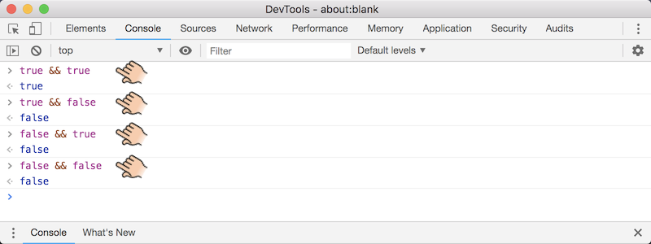

​			（图4-2 与操作）

由于与操作总共才有四种可能的情况，所以可以把这四种情况全部写出来，列成一张表。我们称这张表为与操作的**真值表**，如下所示。

| 左操作数 | 右操作数 | 结果   |
| -------- | -------- | ------ |
| 😊 true    | 😊 true    | 😊 true  |
| 😊 true    | 😢 false   | 😢 false |
| 😢 false   | 😊 true    | 😢 false |
| 😢 false   | 😢 false   | 😢 false |

​			（表4-1 与操作真值表）

### 4.2.2 或

“或”对两个布尔值进行**或者**操作。也就是说，如果两个值至少有一个为真，计算结果就为真，否则计算结果为假。还以金鱼和燕子为例，金鱼会飞（假）或者燕子会飞（真）为真，金鱼会飞（假）或者燕子会游泳（假）为假。”或“操作在JavaScript语言里用紧挨在一起的两个竖线`||`表示，如下图所示。

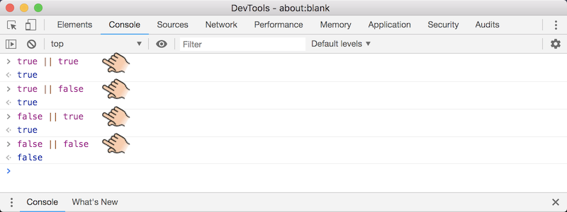

​			（图4-3 或操作）

同样的，或操作也只有四种可能的情况。全部列出来就可以制成或操作的真值表，如下所示。

| 左操作数 | 右操作数 | 结果    |
| -------- | -------- | ------- |
| 😊 true    | 😊 true    | 😊 true   |
| 😊 true    | 😢 false   | 😊 true   |
| 😢 false   | 😊 true    | 😊 true   |
| 😢 false   | 😢 false   | 😢 false |

​			（表4-2 或操作真值表）

### 4.2.3 非

“非”对一个布尔值进行**否定**操作。也就是，如果值为真，那么计算结果为假，否则计算结果为真。比如说燕子会飞为真，那么燕子不会飞为假。燕子会游泳为假，那么燕子不会游泳为真。“非”操作在JavaScript语言里用英文叹号`!`表示，如下图所示。

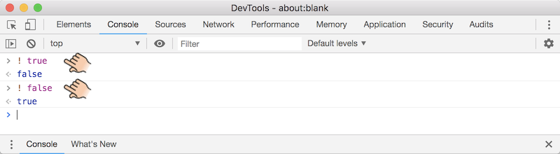

​			（图4-4 非操作）

非操作的可能就更少了，只有两种情况。下面是非操作的真值表。

| 操作数  | 结果    |
| ------- | ------- |
| 😊 true  | 😢 false |
| 😢 false | 😊 true  |

​			（表4-3 非操作真值表）

### 4.2.4 逻辑运算的性质

如果大家认真阅读过第3章内容的话，应该能够看出，与和或操作需要两个操作数，所以`&&`和`||`属于**二元运算符**。非操作只需要一个操作数，所以`!`属于**一元运算符**。另外，作者还可以告诉大家，就像加减乘除一样，与和或具有**左结合性**，也就是说`a && b && c`等价于`(a && b) && c`，`a || b || c`等价于`(a || b) || c`。非则和正负号一样，具有**右结合性**，也就是说`! ! a`等价于`! (! a)`。

交换律：`a && b`等价于`b && a`；`a || b`等价于`b || a`。

结合律：`(a && b) && c`等价于`a && (b && c)`；`(a || b) || c`等价于`a || (b || c)`。

分配律：`a && (b || c)`等价于`(a && b) || (a && c)`。

（TODO：进一步扩充）

## 4.3 比较运算

除了直接写`true`或者`false`，还有什么方式可以得到布尔值呢？比较运算。浏览器可以对数字进行比较，具体说，可以进行**等于**、**大于**、**大于等于**、**小于**、**小于等于**这五种比较。

### 4.3.1 等于

"等于"操作对两个数进行比较，如果两个数**相等**则结果为真，否则结果为假。在JavaScript语言里，等于操作用紧挨着的两个等号`==`表示，如下图所示。（一个等号用于赋值，下一章介绍）

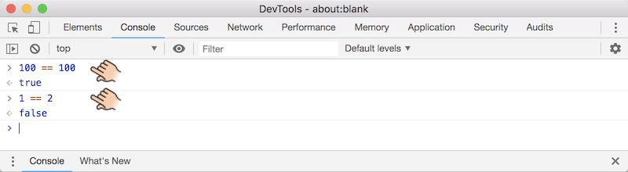

​			（图4-5 等于操作）

### 4.3.2 不等于

"不等于"操作对两个数进行比较，如果两个数**不相等**则结果为真，否则结果为假。在JavaScript语言里，不等于操作用紧挨着的叹号和等号`!=`表示，如下图所示。

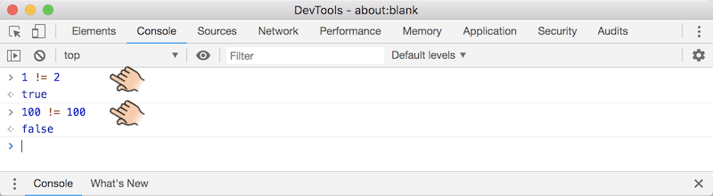

​			（图4-6 不等于操作）

### 4.3.3 大于

"大于"操作对两个数进行比较，如果左操作数**大于**于右操作数则结果为真，否则结果为假。在JavaScript语言里，大于操作用大于号`>`表示，如下图所示。

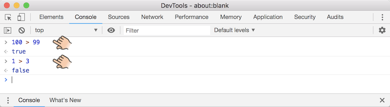

​			（图4-7 大于操作）

### 4.3.4 大于等于

"大于等于"操作对两个数进行比较，如果左操作数**大于或者等**于右操作数则结果为真，否则结果为假。在JavaScript语言里，大于等于操作用紧挨着的大于号和等于号`>=`表示，如下图所示。

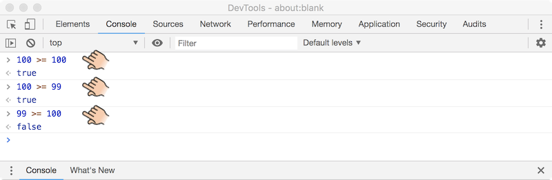

​			（图4-8 大于等于操作）

### 4.3.5 小于

"小于"操作对两个数进行比较，如果左操作数**小于**于右操作数则结果为真，否则结果为假。在JavaScript语言里，小于操作用小于号`<`表示，如下图所示。

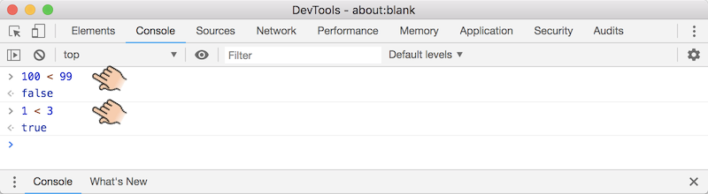

​			（图4-9 小于操作）

### 4.3.6 小于等于

"小于等于"操作对两个数进行比较，如果左操作数**小于或者等**于右操作数则结果为真，否则结果为假。在JavaScript语言里，小于等于操作用紧挨着的小于号和等于号`<=`表示，如下图所示。

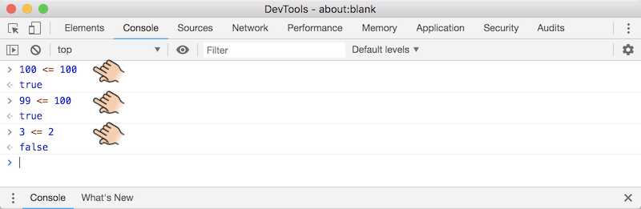

​			（图4-10 小于等于操作）

## 4.4 趣味小实验

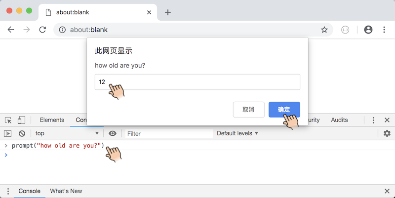

​			（图4-11 调用`prompt()`函数）

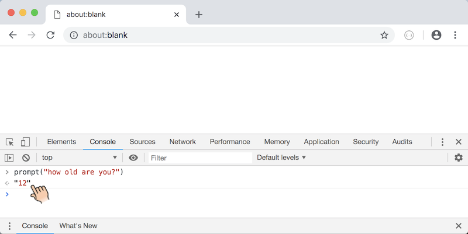

​			（图4-12 `prompt()`函数返回值）

## 4.5 词汇表

* **Boolean** 布尔值
* **False** 假
* **Logic** 逻辑
* **True** 真

## 4.6 小结

TODO

## 4.7 练习

TODO

