# 第1章 成为小程序员

本章内容

* 准备编程环境
  * 计算机简史
  * 操作系统简史
  * 浏览器简史
* 成为小程序员
  * Edge浏览器
  * IE浏览器
  * Firefox浏览器
  * Chrome浏览器
  * Safari浏览器
  * 小技巧
* 趣味小实验
* 词汇表
* 本章小结

## 1.1 准备编程环境

这一节简单介绍一下计算机、操作系统和浏览器的发展历史，对计算机已经非常了解的小朋友们可以直接跳到下一节继续阅读。

### 1.1.1 计算机简史

要想进行编程，首先要有一台**电子计算机**，也就是我们平常所说的**电脑**。这一小节我们先简单了解一下计算机的发展历程。

第一台电子计算机诞生于二十世纪三四十年代，那时候的计算机非常庞大，也非常昂贵，只有政府机构、大学、或者很有钱的公司才能买得起。随着科技的飞速发展，计算机变得越来越小，计算速度也越来越快。大约每18个月，计算机的体积就能缩小一半，价格也能便宜一半，计算速度却能提升一倍，这就是著名的**摩尔定律**。

到了二十世纪七八十年代，经过几十年的发展，计算机已经变得很小了，价格也降到了普通家庭能够承担的地步。**个人电脑**，也就是我们常说的**PC**（Personal Computer），又叫做**台式机**，在这一时期诞生。今天大家所熟知的苹果公司也在这一时期成立，开始生产并销售个人电脑。

再经过二三十年的发展，计算机进一步变小，逐渐演变成了可以放进书包里的**笔记本电脑**。那么到了现在，计算机已经小到可以放进我们的口袋里了，这就是大家每天都会使用的**智能手机**。远古计算机、个人电脑、笔记本电脑、智能手机如图1-1所示。

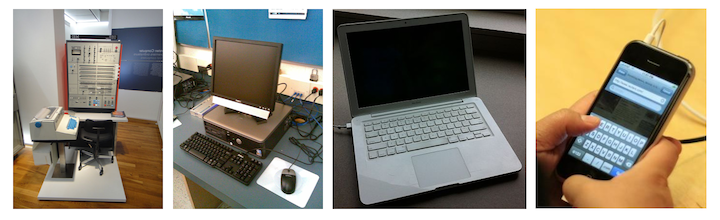

​			（图1-1 各个时期的计算机，图片来源于网络）

如果小朋友们想要跟着本书学习编程的话，家里只需要有一台不是太古老的台式机或者笔记本电脑就可以了。

### 1.1.2 操作系统简史

计算机必须要运行**程序**才能体现其价值，否则就是一堆废铁。早期的电子计算机不仅体积庞大，操作起来也非常不方便。程序员需要先把编写好的程序和数据制成打孔卡片，然后把卡片放入计算机，最后等着计算机运行程序并观察结果。这些操作非常麻烦，而且由于当时的计算机每次只能执行一个程序，所以等待的过程也很漫长。因为这些原因，在那个年代计算机一般都由专门的操作员来操作。

为了让计算机更容易使用，计算机科学家们发明了**操作系统**。最开始操作系统只是自动装载某个程序的打孔卡片，运行程序并记录结果，然后装载并运行下一个程序，直到所有程序都运行完毕为止。慢慢的操作系统的功能变得越来越复杂，最终演变出了我们现在所使用的现代操作系统。随着磁带和磁盘等存储设备的出现，打孔卡片和计算机操作员也早已退出了历史舞台。

由于操作系统也只是一段普通的程序，也是由计算机运行。为了区别于操作系统，我们把其他被操作系统运行的程序叫做**应用程序**。由于各种远古操作系统距离我们太久远了，所以这一小节只介绍**Unix**和**Windows**这两种现代操作系统。

Unix操作系统于二十世纪七十年代诞生于贝尔实验室，由于其设计理念非常先进，所以很快就流行了起来。1991年，Unix的后继者**Linux**操作系统诞生，并且逐渐取代了Unix的地位。1999年，苹果公司发布了基于Unix的**Darwin**操作系统，并且推出了基于Darwin的**macOS**操作系统（当时叫做Mac OS X）。到了2007年，苹果公司推出了跨时代的**iPhone**智能手机，其搭载的是同样基于Darwin的**iOS**操作系统（当时叫做iPhone OS）。同年，Google公司也推出了**Android**智能手机，搭载的则是基于Linux的**Android**操作系统。

如果小朋友们没有听说过Unix操作系统，那也很正常，因为它的风头已经大不如前了。不过它的后继者们却依然很风光，特别是控制着全球绝大部分智能手机的iOS和Android操作系统，如图1-2所示。

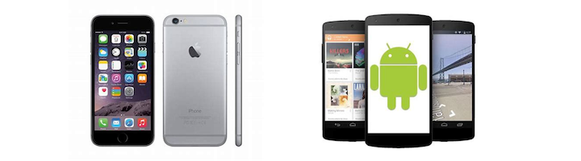

​			（图1-2 iOS和Android操作系统，图片来源于网络）

虽然Unix操作系统在智能手机时代独占鳌头，但是在之前的PC时代，Windows操作系统才是主角。微软公司于1985年推出了Windows 1.0操作系统，不过并没有获得太多的关注。直到1990年，Windows 3.0的发布才让Windows操作系统逐渐流行起来。到了1995年，Windows 95发布，里面内置了马上将要介绍的**IE**浏览器，互联网时代到来。随后微软公司又陆续发布了大受欢迎的Windows 98、Windows 2000和Windows XP等升级版本。到了2009年，Windows操作系统放弃年份，重新使用数字作为版本号，这一年Windows 7发布。2012年，Windows 8发布。2015年，Windows 10发布。Windows、macOS和Linux操作系统如图2-3所示。

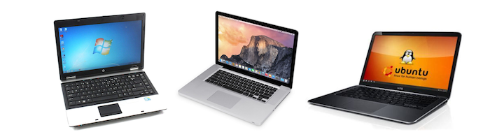

​			（图2-3 Windows、macOS和Linux操作系统，图片来源于网络）

虽然说在智能手机上面也可以编程，不过屏幕太小了，操作起来也不方便，所以本书将教大家如何在PC和笔记本电脑上编写程序。请小朋友们打开家里的电脑，并检查上面是否运行着较新版本的Windows或者macOS操作系统（可以请家长帮忙）。如果没问题的话，下面我们一起来回顾一下互联网和浏览器的发展历程。

### 1.1.3 浏览器简史

电子计算机诞生后不久，人们就发现把分布在各个地方的计算机连接起来可以做更多的事情，于是计算机网络便诞生了。当然，那时候的计算机还是使用网线连接，不像现在，大部分计算机是通过无线网进行连接。1971年，**电子邮件**诞生并一直使用至今。1974年，支撑现今整个互联网底层的**TCP/IP**协议诞生。1989年，**HTTP**协议和**万维网**（WWW，World Wide Web）诞生。但是即使到了1990年代早期，计算机网络也只有少数科学家和计算机专家才会使用，远非离普通大众所能掌握。

不过互联网时代很快就会到来，因为在1994年，一家叫做网景（Netscape）的公司发布了**Netscape**浏览器。有了这款浏览器，访问互联网一下子就变的非常容易，以至于普通人也可以很快学会上网，而各种网站也如雨后春笋般被建立起来。一年以后，也就是1995年，可以在浏览器里运行的**JavaScript**语言诞生。至此，人们不仅可以使用浏览器访问网页，还可以执行复杂的程序。

随着Netscape浏览器的流行，网景公司也一跃成为当时全球最大的软件公司之一。微软公司感觉到了威胁，于是开始研发IE浏览器，著名的浏览器大战拉开帷幕。结局大家也许已经知道了，微软公司很快便推出了IE（Internet Explorer）浏览器，并将其内置在了Windows 95操作系统中，通过这种方式赢得了浏览器大战，网景公司和它的Netscape浏览器则慢慢退出了公众的视野。Netscape浏览器虽败犹荣，让我们一睹它当年的风采：

​			（图2-4 Netscape Navigator 1.22，图片来源于网络）

1998年，网景公司被其他公司收购。虽然网景公司彻底失败了，但是它却成立了**Mozilla**组织继续开发浏览器。2004年，Mozilla发布了**Firefox**浏览器，重新开始挑战微软的IE浏览器，第二轮浏览器大战由此拉开帷幕。2008年，Google公司发布了**Chrome**浏览器，也加入了此次浏览器大战。2015年，微软公司发布了最新的**Edge**浏览器，并取代IE成为Windows 10操作系统的默认浏览器。此外，苹果公司的**Safari**浏览器由于内置在masOS操作系统中，也很受欢迎。与第一次浏览器大战不同，第二次浏览器大战至今未分出明显的胜负，下面是目前最流行的四种浏览器的图标。

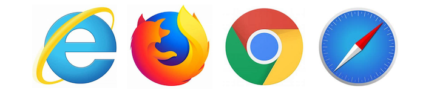

​			（图2-5 IE、Firefox、Chrome和Safari浏览器图标，图片来源于网络）

到这里互联网和浏览器的历史就简单介绍完了，如果小朋友家里的电脑安装的是Windows操作系统，那么自带了IE或者Edge浏览器。如果使用的是macOS操作系统，那么自带了Safari浏览器。而不管是哪种操作系统，都可以下载安装并使用Firfox或者Chrome浏览器。请小朋友们在家长的帮助下打开以上介绍的任何一款浏览器，因为我们马上就要开始学习如何在浏览器里编写并运行自己的第一行JavaScript程序了！

## 1.2 成为小程序员

这一节先依次介绍如何在Windows下的Edge、IE 11、Firfox、Chrome和macOS下的Safari浏览器中开启**开发者工具**，以及如何在开发者工具里编写并运行JavaScript代码，最后介绍几个开发者工具的操作小技巧。请小朋友们确认自己使用的是哪种浏览器，然后跳到相应的小节开始学习。让我们从最新的Edge浏览器开始。

### 12.2.1 Edge浏览器

打开Edge浏览器，在**地址栏**里输入`about:blank`然后按回车键，这样就打开了一个空白页面，如下图所示。

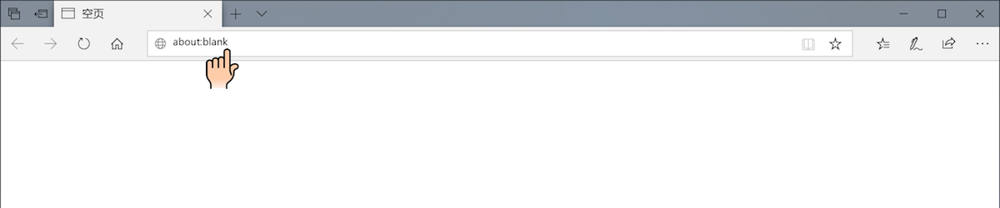

​			（图2-6 Edge浏览器空白页面）

在浏览器窗口的右上角，关闭按钮（小叉子）的下面，可以看到三个小点，点它就可以展开“**设置及其他**”菜单。点击菜单下方的“**更多工具**”菜单项，可以展开另一个小菜单。点击小菜单里的“**开发人员工具**”菜单项就可以打开开发人员工具，如下图所示。另外，我们也可以通过直接按键盘上的**F12**键打开开发人员工具。

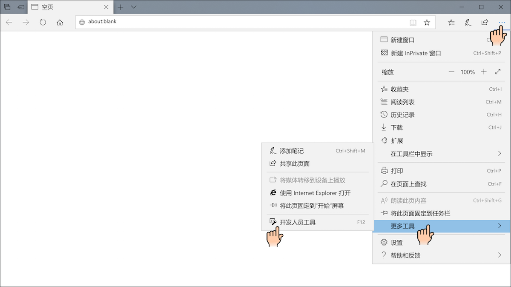

​			（图2-7 打开Edge浏览器开发人员工具）

此时浏览器窗口分成了两个部分，开发人员工具默认在右边。开发人员工具有好几个选项卡，我们需要选中“**控制台**”选项卡，这样选项卡的下面就会出现一个小的输入框，输入框的最左边是一个`>`符号，提示我们在这里可以输入JavaScript代码。请小朋友们在输入框里输入`alert("Hello, World!")`，然后按回车键。这里一定要输入英文的**圆括号**和**引号**，千万不能出错。如果没有输入错误的话，按下回车键之后就会弹出一个对话框，上面会显示“Hello, World!”，点击文字下方的“确定”按钮可以关闭对话框，如下图所示。恭喜你正式成为了一名JavaScript小程序员！

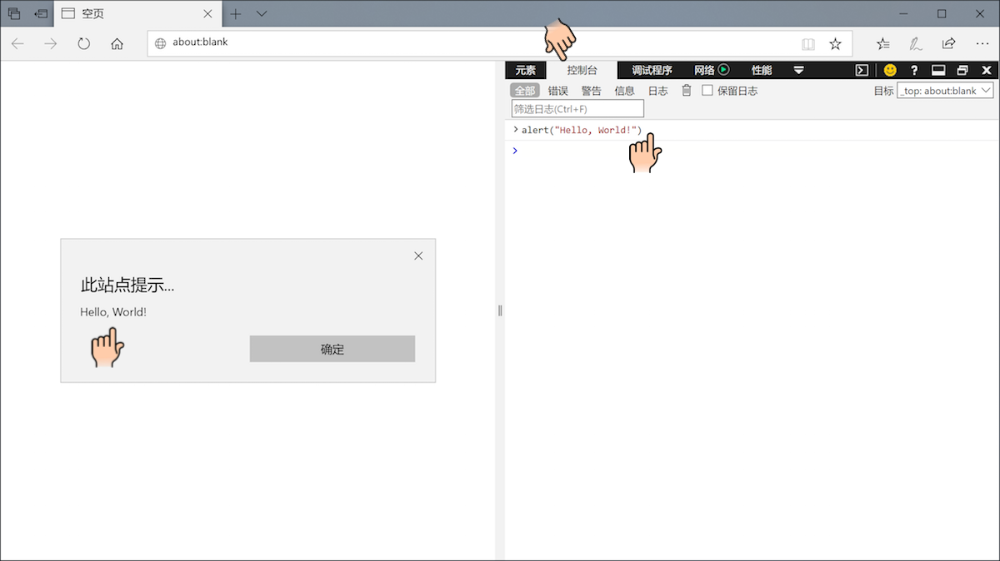

​			（图2-8 在Edge浏览器里执行JavaScript代码）

### 12.2.2 IE浏览器

打开IE浏览器，在**地址栏**里输入`about:blank`然后按回车键，这样就打开了一个空白页面。在浏览器窗口的右上角，关闭按钮（小叉子）的下面，可以看到一个小齿轮，点它就可以展开“**工具**”菜单。点击菜单下方的“**开发人员工具**”菜单项就可以打开开发人员工具，如下图所示。另外，我们也可以通过直接按键盘上的**F12**键打开开发人员工具。

​		（图2-9 打开IE浏览器开发人员工具）

此时浏览器窗口分成了两个部分，开发人员工具默认在下边。开发人员工具有好几个选项卡，我们需要选中“**控制台**”选项卡，这样选项卡的底部就会出现一个输入框，输入框的最左边是一个`>`符号，提示我们在这里可以输入JavaScript代码。请小朋友们在输入框里输入`alert("Hello, World!")`，然后按回车键，如下图所示。

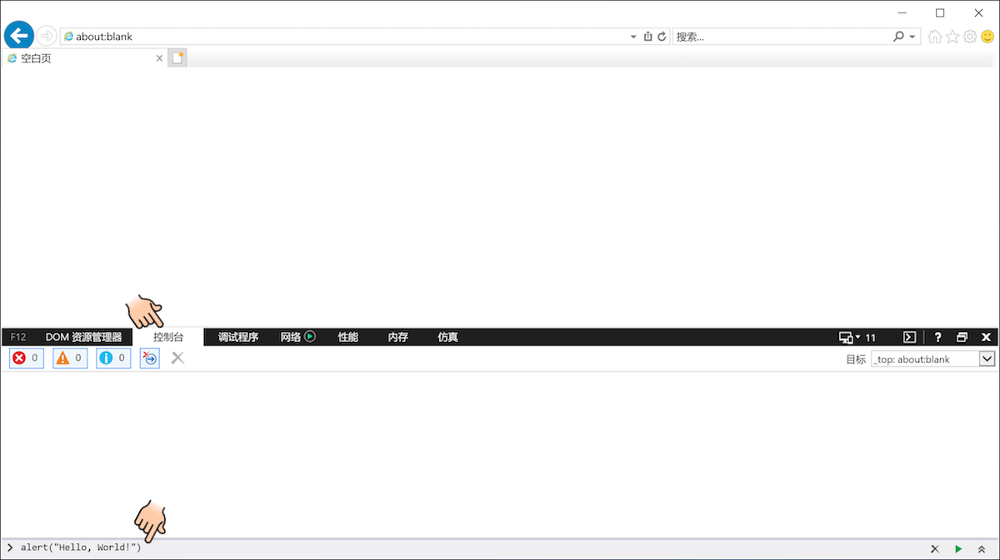

​		（图2-10 在IE浏览器里输入JavaScript代码）

注意一定要输入英文的**圆括号**和**引号**，千万不能出错。如果没有输入错误的话，按下回车键之后就会弹出一个对话框，上面会显示“Hello, World!”，点击文字下方的“确定”按钮可以关闭对话框，如下图所示。恭喜你正式成为了一名JavaScript小程序员！

​		（图2-11 在IE浏览器里执行JavaScript代码）

### 12.2.3 Firefox浏览器

打开Firefox浏览器，在**地址栏**里输入`about:blank`然后按回车键，这样就打开了一个空白页面。在浏览器窗口的右上角，关闭按钮（小叉子）的下面，可以看到三条短横杠，点它就可以展开菜单。菜单的下面有一个“**Web开发者**”菜单项，如下图所示。

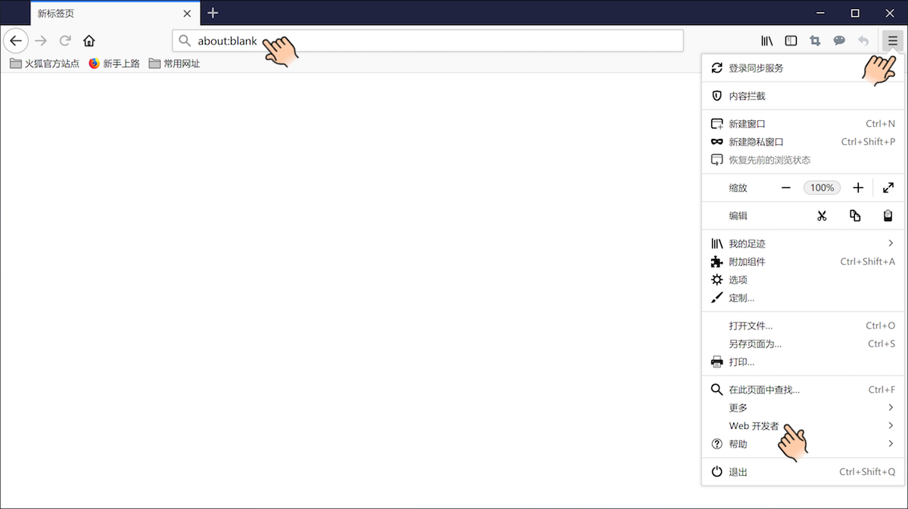

​			（图2-12 打开Firefox菜单）

点击“Web开发者”菜单项会进入另外一个菜单，靠上面有一个选项是“**Web控制台**”菜单项，如下图所示：

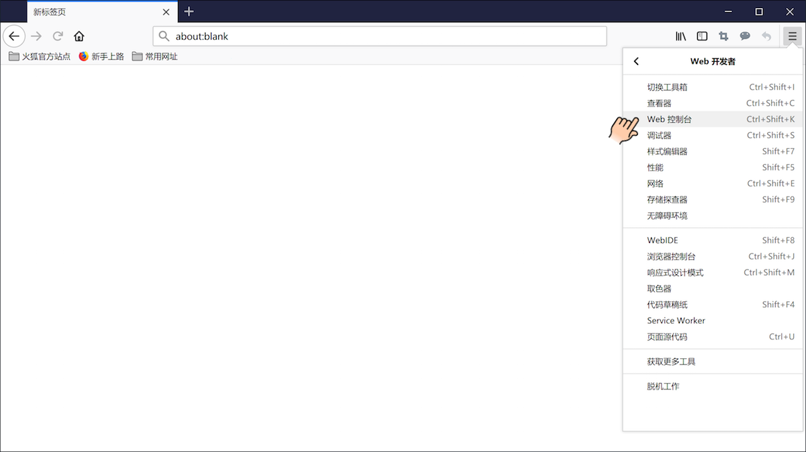

​			（图2-13 打开FirefoxWeb开发者菜单）

点击“Web控制台”菜单项就可以打开开发者工具，如下图所示。另外，我们也可以通过同时按下键盘上的**Ctrl+Shift+K**键打开开发者工具。此时浏览器窗口分成了两个部分，开发者工具默认在下边。开发者工具有好几个选项卡，我们需要选中“**控制台**”选项卡，这样选项卡的下方会出现一个输入框，输入框的最左边是一个`>>`符号，提示我们在这里可以输入JavaScript代码。

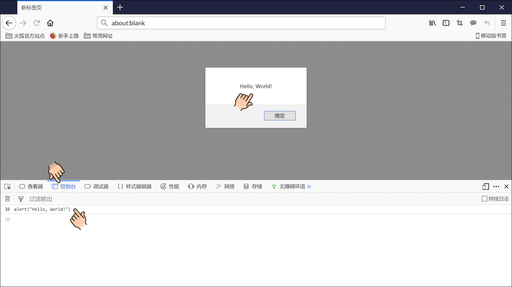

​			（图2-14 在Firefox浏览器里执行JavaScript代码）

请小朋友们在输入框里输入`alert("Hello, World!")`，然后按下回车键。注意一定要输入英文的**圆括号**和**引号**，千万不能出错。如果没有输入错误的话，按下回车键之后就会弹出一个对话框，上面会显示“Hello, World!”，点击文字下方的“确定”按钮可以关闭对话框，如上图所示。恭喜你正式成为了一名JavaScript小程序员！

### 12.2.4 Chrome浏览器

打开Chrome浏览器，在**地址栏**里输入`about:blank`然后按回车键，这样就打开了一个空白页面。在浏览器窗口的右上角，关闭按钮（小叉子）的下面，可以看到三个小点，点它就可以展开菜单。菜单的下方有一个“**更多工具**”菜单项，点这个菜单项会展开另外一个小菜单，小菜单的下方有一个“**开发者工具**”菜单项，点击它就可以打开开发者工具，如下图所示。另外，我们也可以通过同时按下键盘上的**Ctrl+Shift+I**键打开开发者工具。

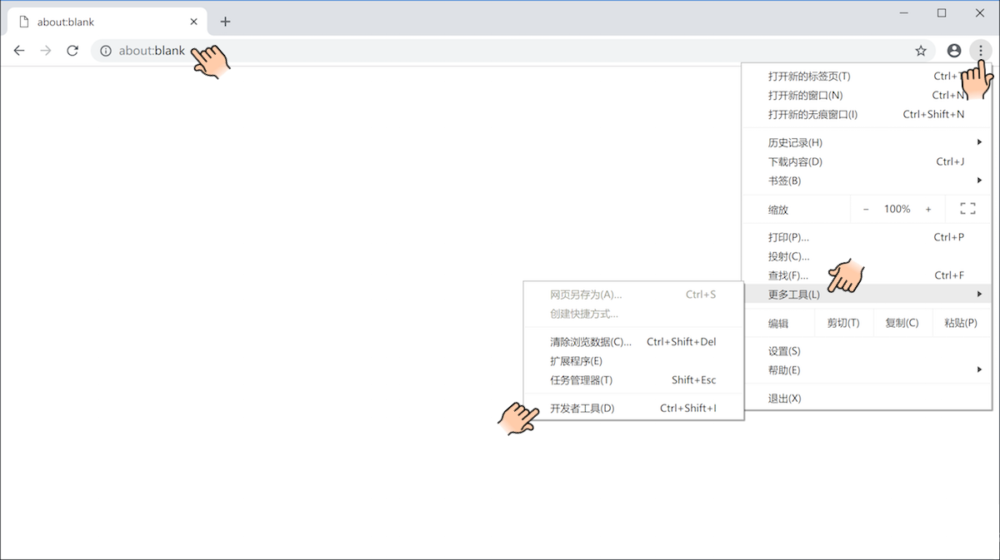

​			（图2-15 打开Chrome浏览器开发者工具）

此时浏览器窗口分成了两个部分，开发者工具默认在右边。开发者工具有好几个选项卡，我们需要选中“**控制台**”选项卡，这样选项卡的下方会出现一个输入框，输入框的最左边是一个`>`符号，提示我们在这里可以输入JavaScript代码。请小朋友们在输入框里输入`alert("Hello, World!")`，然后按回车键，如下图所示。

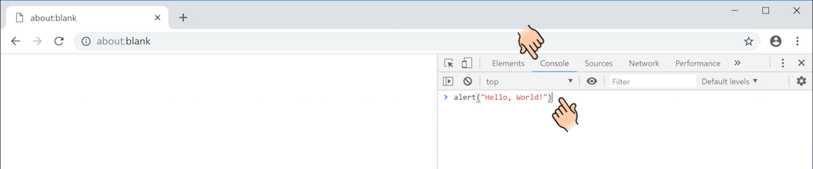

​			（图2-16 在Chrome浏览器里输入JavaScript代码）

注意一定要输入英文的**圆括号**和**引号**，千万不能出错。如果没有输入错误的话，按下回车键之后就会弹出一个对话框，上面会显示“Hello, World!”，点击文字下方的“确定”按钮可以关闭对话框，如下图所示。恭喜你正式成为了一名JavaScript小程序员！

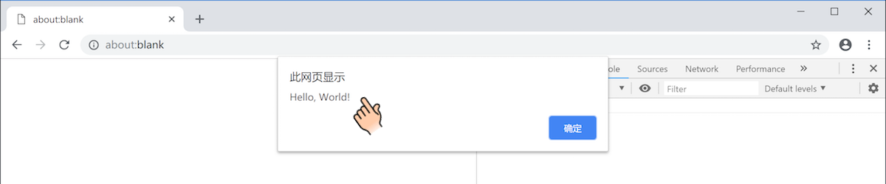

​			（图2-17 在Chrome浏览器里执行JavaScript代码）

### 12.2.5 Safari浏览器

打开Safari浏览器，在**地址栏**里输入`about:blank`然后按回车键，这样就打开了一个空白页面。和其他浏览器不同，Safari浏览器需要设置一下才能打开开发者工具。从菜单栏中打开“**偏好设置**”对话框，然后选中“**高级**”选项卡，最后在“**在菜单栏中显示“开发”菜单**”复选框中打勾并关闭对话框就可以了，具体操作如下图所示。

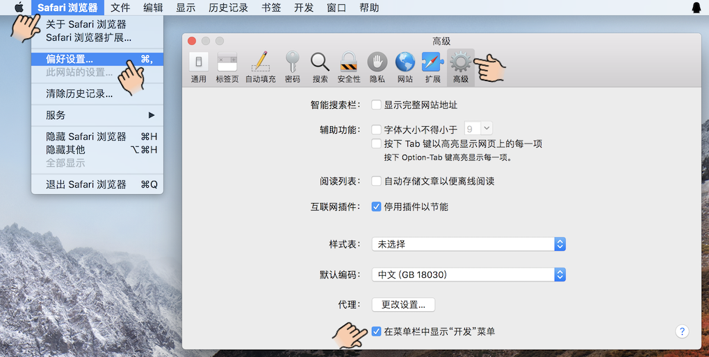

​			（图2-18 在Safari浏览器菜单栏中显示“开发”菜单）

设置完毕后，菜单栏里会出现“**开发**”菜单项。展开“开发”菜单，可以看到“**显示JavaScript控制台**”菜单项，点击它就可以打开开发者工具，如下图所示。另外，也可以通过同时按下键盘上的**⌥+⌘+I**键打开开发者工具。

​			（图2-19 在Safari浏览器显示JavaScript控制台）

此时浏览器窗口分成了两个部分，开发者工具默认会出现在下边。开发者工具有好几个选项卡，我们需要选中“**控制台**”选项卡，这样开发者工具的最下面会出现一个输入框，输入框的最左边是一个`>`符号，提示我们在这里可以输入JavaScript代码。请小朋友们在输入框里输入`alert("Hello, World!")`，然后按回车键，如下图所示。

​			（图2-20 在Safari浏览器里输入JavaScript代码）

注意一定要输入英文的**圆括号**和**引号**，千万不能出错。如果没有输入错误的话，按下回车键之后就会弹出一个对话框，上面会显示“Hello, World!”，点击文字下方的“确定”按钮可以关闭对话框，如下图所示。恭喜你正式成为了一名JavaScript小程序员！

​			（图2-21 在Safari浏览器里执行JavaScript代码）

### 12.2.6 小技巧

由于我们以后要经常使用开发者工具，特别是使用控制台编写并执行JavaScript程序，所以这一小节介绍几个操作方面的小技巧。有了这些技巧，使用起开发者工具来就会更加得心应手。

1. 如果想关闭开发者工具，点工具左上角或者右上角的小叉子即可。
2. 选中JavaScript输入框，按键盘上的上下箭头键（⇧⇩）可以快速输入之前执行过的代码。
3. JavaScript输入框里默认只能输入一行代码，按回车就会执行代码。如果想输入多行代码，可以先按住Shift再按回车键。
4. 执行JavaScript代码后，控制台里可能会出现很多信息。这些信息在后面会变得非常有用，如果想清理这些信息，点击控制台选项卡下方的小垃圾桶、小叉子或者带斜线的圆圈（⦸）即可。
5. 每个浏览器都有默认的开发者工具停靠方式，如果想改变停靠方式，或者把开发者工具变成单独的窗口，在Edge和IE浏览器里直接点击开发者工具小叉子左边的小窗口即可。在Firefox和Chrome浏览器里，先点击小叉子左边的三个小点，然后在展开的菜单里选择不同的停靠方式。在Safari浏览器里，先点击开发者工具右上角的小齿轮，然后在展开的菜单里选择不同的停靠方式。

以Chrome浏览器为例，这些操作开发者工具的小图标如下图所示。本书后面的章节主要使用Chrome浏览器演示JavaScript代码，不过这些代码在其他浏览器里的执行效果也应该一样。

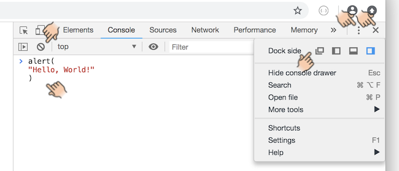

​			（图2-22 操作Chrome浏览器开发者工具）

## 12.3 趣味小实验

这一节我们一起来做一个有趣的小实验。请小朋友们打开浏览器和开发者工具，在控制台里输入这行代码后按回车键：`document.body.style.backgroundColor = "yellow"`。怎么样？有没有观察到什么变化？再把`yellow`换成其他颜色的单词，比如`red`，看看会出现什么效果。

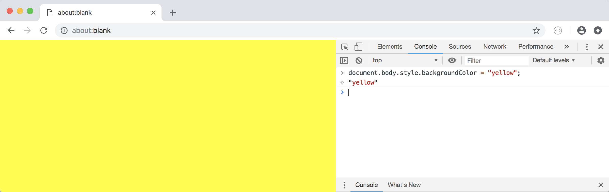

​			（图2-23 用JavaScript改变浏览器背景颜色）

## 12.4 词汇表

* **About** 关于
* **Alert** 警告
* **Android** 机器人/安卓操作系统
* **App（Application）** 应用程序
* **Blank** 空白
* **Browser** 浏览器
* **Computer** 计算机
* **Email** 电子邮件
* **Internet** 互联网/因特网
* **Java** 爪哇岛/爪哇咖啡/爪哇语言
* **Laptop** 笔记本电脑
* **Menu** 菜单
* **OS（Operating System）** 操作系统
* **PC（Personal Computer）** 个人电脑
* **Program** 程序
* **Programmer** 程序员
* **Script** 剧本/脚本
* **Web** 网

## 12.5 本章小结

TODO

