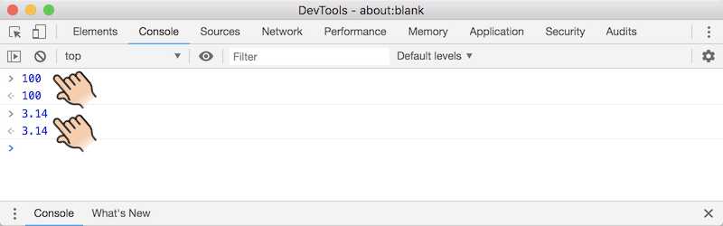
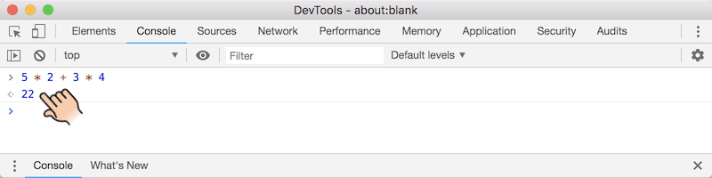

# 第3章 数字和算术运算

在开始学习本章内容之前，请小朋友们仔细阅读本书的第一章，然后回答下面这几个问题：

* 家里用的什么类型的**电脑**，台式机还是笔记本电脑？
* 电脑上面跑的是什么**操作系统**，Windows还是macOS？
* 使用电脑上网时使用的是什么**浏览器**，Edge还是IE、Chrome、Firefox或者Safari？
* 是否能够打开浏览器的**开发者工具**？


本章内容
* 数字
* 算术运算
  * 四则运算（加、减、乘、除）
  * 求余
  * 乘方
* 算术运算的性质
  * 操作数
  * 结核性
  * 优先级
* 趣味小实验
* 词汇表
* 本章小结


## 3.1 数字

如果小朋友们在上数学课时没有睡大觉而是认真听讲的话，应该对数字已经非常熟悉了。这一节我们简单回顾一下数字的历史，借此复习一下数字的分类。

在很久很久以前，人类的大脑只能理解非常简单的数字。比如说你有一头牛，我有两条鱼，他有三十个苹果。我们现在称1、2、30等等这些数字为**正整数**。过了很久，人们突然发现，不知道该如何表示一无所有，所以**零**就诞生了。0和正整数一起，构成了**自然数**。

又过了很久，人们又发现自然数也不够用了。比如说我和你借了五个鸡蛋，给吃掉了，那么我现在拥有几个鸡蛋呢？于是**负数**，准确的说是负整数诞生了。负数除了可以表示欠账，在其他地方也很有用，比如说大楼的地下一层就可以用-1层来表示。负整数和自然数一起，构成了全部的**整数**。

又过了很久，人们发现整数也不足以表达自己的思想了。比如说我有一张饼，分给你一半，那么咱俩各有几张饼呢？于是**分数**，比如1/2、4/7就诞生了。整数和分数一起，构成了**有理数**。

分数也可以用整数和小数点表示成和**小数**，比如7/10可以写成0.7，5/2可以写成2.5。那么把1/3写成小数是多少呢？是0.33333……，没错，就算我们把全世界的纸都用光也写不完，因为0的后面会有无穷多个3。像0.5这种可以完全写出来的小数叫做**有限小数**，像0.33333.....这种永远也写不完的小数叫做**无限小数**。那么是不是所有的小数，反过来都能表示成分数呢？也不是，比如我国伟大的数学家祖冲之发现的圆周率3.1415926……就没办法用分数来表示。这种没办法用分数来表示的小数，叫做**无理数**。有理数和无理数一起，构成了**实数**。

既然有实数，那么想必也一定有**虚数**吧？没错。不过对于虚数的介绍超出了本书的讨论范围。感兴趣的小朋友们可以通过阅读其他的数学读物来了解虚数。实数和虚数一起，构成了**复数**。数字的分类如下图所示：

```
                               / 零
                       / 自然数
                 / 整数         \ 正整数
          / 有理数      \ 负整数
    / 实数        \ 分数
复数       \ 无理数
    \ 虚数
```

我们人类的语言可以表达这么多不同类型的数字，不过浏览器却只能理解整数和小数。如果我们朝着山谷大喊一声，山谷会返回给我们一模一样的回声。类似的，如果我们在浏览器开发者工具控制台的输入框（后面简称输入框）里输入整数或者小数并按下回车键，浏览器就会回把输入的数字原封不动的返回给我们，如下图所示。小朋友们可以通过这种方式把自己喜欢的任何数字告诉浏览器，看看浏览器是否会如实返回。



​			（图2-1 JavaScript语言可以表达整数和小数）


## 3.2 算术运算

如果你认为浏览器只会傻傻的回显数字，那么你就错了。浏览器不仅认识数字，还能进行算术运算。下图演示了如何使用浏览器进行加减乘除四则运算，小朋友们可以跟着操作哦。


​			（图2-2 用浏览器进行四则运算）

可以看到，JavaScript语言里的加号`+`和减号`-`和我们在数学课上使用的符号一样。不过由于键盘上没有乘号`×`和除号`÷`，所以就用星号`*`和斜杠`/`代替。由上面的例子可以看出，如果两个整数除不尽的话，结果就是一个小数。如果我们想计算两个整数相除所得的余数，把除号`/`替换成求余符号，也就是百分号`%`就可以了，如下图所示。


​			（图2-3 用浏览器计算除法的余数）

除了普通的乘法，浏览器还可以进行**平方**、**立方**、或者任意次方的**乘方**运算。进行乘方运算的符号是两个连在一起的星号`**`，下图演示了如何计算4的平方、3的立方以及2的10次方。


​			（图2-4 用浏览器进行乘方运算）


## 3.3 算术运算的性质

前一节介绍了如何用浏览器进行简单的计算，这一节我们来学习一些稍微复杂的操作，借此来熟悉操作数、优先级和结合性。


### 3.3.1 操作数

前面介绍的加、减、乘、除、求余、乘方运算都是对运算符左右两边的两个数字进行计数，我们称这些运算符左右两边的数字为**操作数**，称这种需要两个操作数的运算符为**二元运算符**。有趣的是，对于加号和减号，实际上也可以只在运算符的右边有一个数字，此时我们称加号为**正号**，称减号为**负号**，称这种只需要一个操作数的运算符为**一元运算符**。

正号显得有点多余，因为1和+1的含义完全一样。但是负号就很有意义，因为1和-1完全不同。负号的真正意义在于：它可以对一个数进行**取反**操作。对正数取反会得到相应的负数，对负数取反会得到该负数的**绝对值**。下面的例子演示了正号和负号的用法。


​			（图2-5 正负号的用法）

请小朋友们要注意，两个正号或者负号之间一定要有空格哦，否则就会出问题。在2.3节最后，表2-1列出了各种运算符的操作数数量。


### 3.3.2 优先级

在现实生活中，我们常常要把加减乘除混合起来进行计算。比如说我们去菜市场买菜，买了5个土豆和3个黄瓜。假如土豆是2元钱一个，黄瓜是4元钱一个。我们付给农民伯伯50元钱，那么他应该找我们多少钱呢？聪明的小朋友赶快心算一下吧，给你一分钟的时间哦。

好了，相信小朋友们已经得出了正确的答案。不过我们还是把这个任务交给浏览器吧，看它会不会比我们完成的更好。我们先让浏览器来计算土豆和黄瓜总共需要花多少钱，为此需要把计算价格的式子输入浏览器的输入框并按回车键，就像下面这样。



​			（图2-6 用浏览器执行表达式）

像这样的式子叫做**表达式**。从计算的结果可以看出，浏览器是先进行乘法运算，再进行加法运算的，和我们期望的一样。换句话说，我们称乘法运算符的**优先级**比加法运算符高。那么我们进一步让浏览器把需要找回的零钱也计算一下，像下面这样。


​			（图2-7 加法和减法的优先级相同）

噢哦，浏览器好像出问题了，怎么还要倒找我们钱呢？农民伯伯一定会不高兴的。原来是因为加法和减法运算符具有同样高的优先级，所以浏览器就从左到右进行计算，50减去10再加上12，导致最终得出了错误结果52。浏览器显然误解了我们的意图，因为我们真正的想法是先计算加法，再计算减法。如果出现这种情况，我们就需要用**圆括号**来提升运算符的优先级。或者更正式的说，是对运算进行**分组**。就像下面这样。


​			（图2-8 使用圆括号提升加法的优先级）

请注意，一定要输入英文的圆括号，因为浏览器并不认识中文圆括号。实际上，圆括号也可以把加法或者减法运算符的优先级提升的比乘法运算符和还高，就像下面这样。


​			（图2-9 使用圆括号提升加法和减法的优先级）

另外，虽然乘除法的优先级比加减法高，不过如果我们愿意，也可以用圆括号来强调这一点（虽然没什么必要），就像下面这样。


​			（图2-10 使用圆括号强调乘法的优先级）

以上给出了加减乘除法的优先级，求余运算的优先级和乘除法一样，所以`3 * 4 % 5 + 1`等价于`((3 * 4) % 5) + 1`。指数运算的优先级比乘除法和求余运算要高，所以`4 / 3 ** 2`等价于`4 / (3 ** 2)`。一元加减号的优先级最高。在2.3节最后，表2-1列出了各种运算符的优先级。


### 3.3.3 结合性

从上面的介绍我们已经知道：**乘除法优先级相同，加减法优先级相同，但乘除法比加减法优先级高**。并且知道：**当优先级不同时，先进行优先级高的计算；当优先级相同时，从左到右计算**。还知道**使用圆括号对计算进行分组可以提升计算的优先级**。如果运算符默认是从左到右分组的，我们就称这个运算符具有**左结合性**，反之就称运算符具有**右结合性**。

加减乘除和求余运算符默认是从左到右分组，所以都具有左结合性。以加法为例：`1 + 2 + 3`实际上等价于`(1 + 2) + 3`。一元加减号、乘方运算符默认是从右到左计算，所以具有右结合性。以乘方运算为例，`4 ** 3 ** 2`实际上等价于`4 ** (3 ** 2)`，如下图所示。


​			（图2-11 乘方运算具有右结合性）

就像优先级一样，必要的时候我们也可以使用圆括改变运算符的默认分组规则。这一点对于加减法和乘法来说用处不大（因为加法和乘法满足**交换律**和**结合律**），但是对于除法、求余和乘方来说就非常有用。下面的例子演示了如何使用圆括号改变乘方运算的分组规则。


​			（图2-12 使用圆括号改变乘方运算的分组规则）

表2-1列出了各种运算符的操作数数量、优先级和结合性。

| 运算符                    | 操作数 | 优先级       | 结合性        |
| ------------------------- | ------ | ------------ | ------------- |
| 正号`+`、负号`-`          | 1      | ★★★★（最高） | ←（从右到左） |
| 乘方`**`                  | 2      | ★★★☆         | ←（从右到左） |
| 乘法`*`、除法`/`、求余`%` | 2      | ★★☆☆         | →（从左到右） |
| 加法`+`、减法`-`          | 2      | ★☆☆☆（最低） | →（从左到右） |

​			（表2-1 运算符操作数数量、优先级和结合性）


## 3.4 趣味小实验
请小朋友们打开浏览器，把窗口调整成自己喜欢的大小，然后打开开发者工具。在控制台里输入`window.innerWidth`并按回车，浏览器就会告诉我们窗口的**宽度**；输入`window.innerHeight`并按回车，浏览器就会告诉我们窗口的**高度**。宽度和高度的单位是像素（计算机的屏幕显示的实际上是一排排密密麻麻很小的点，每一个点就叫做一个**像素**）。知道了窗口的宽度和高度，我们就可以计算窗口的面积，如下图所示。请小朋友们随意改变窗口的大小，然后计算面积。让我们愉快的玩耍吧。


​			（图2-13 计算浏览器窗口的面积）


## 3.5 词汇表

* **height** 高
* **width** 宽
* **pixel** 像素


## 3.6 本章小结
TODO

